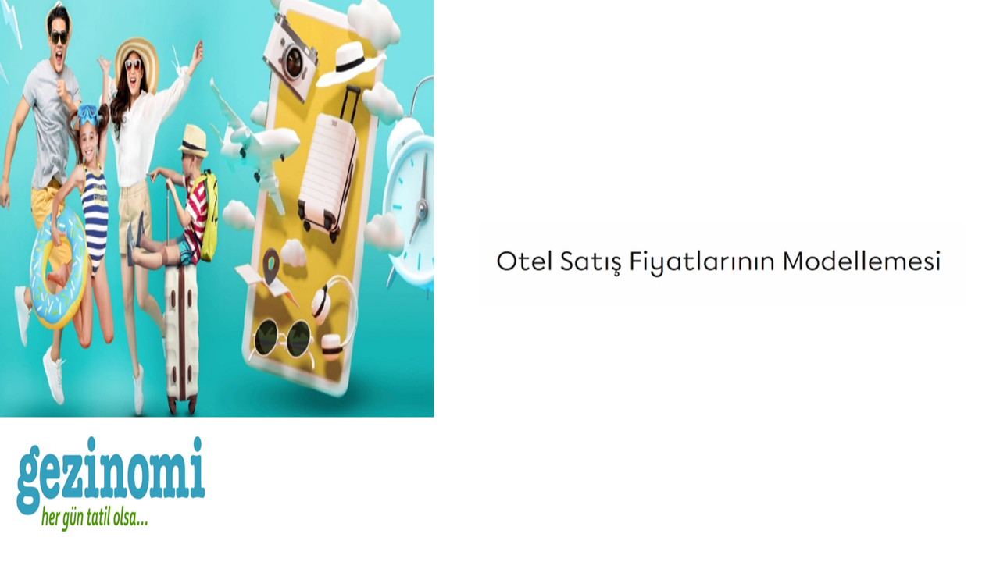

# Gezinomi-Modeling-of-Hotel-Sales-Prices

 

## Business Problem 

Using sales data from Gezinomi, we want to estimate the average hotel fee for future customers. **For example:** We want to determine the estimated price a customer would pay if they wanted to stay in a half-board hotel during a busy season in Izmir.

## Dataset Story

The **gezinomi_miuul.xslx** dataset contains the prices of sales made by Gezinomi and information about these sales. The dataset consists of records created for each sales transaction. This means that the tables are not deduplicated. In other words, each customer may have made a reservation more than once.

## Features of Dataset

- **Total Features :** 9
- **Total Row :** 59.164
- **CSV File Size :** 2.44 MB

## Variable Descriptions

**SaleId:** Sales ID

**SaleDate:** Date of Sales

**CheckInDate:** Customer's hotel check-in date

**Price:** Price paid for sale

**ConceptName:** Hotel concept information

**SaleCityName:** Information about the city where the hotel is located

**CInDay:** The day the customer checks in to the hotel

**SaleCheckInDayDiff:** Day difference between check-in and check-in date

**Seasons:** Season information on hotel check-in date
